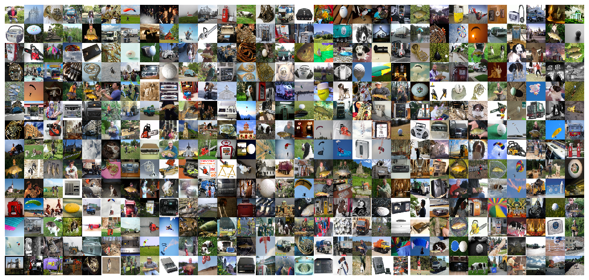
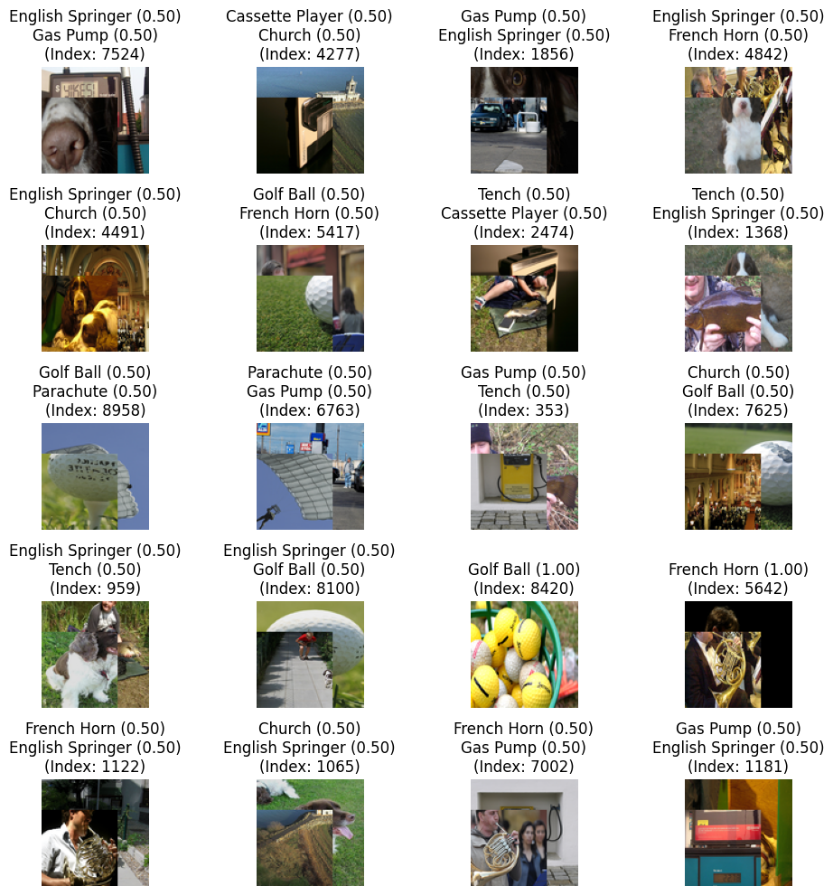
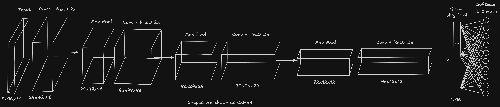
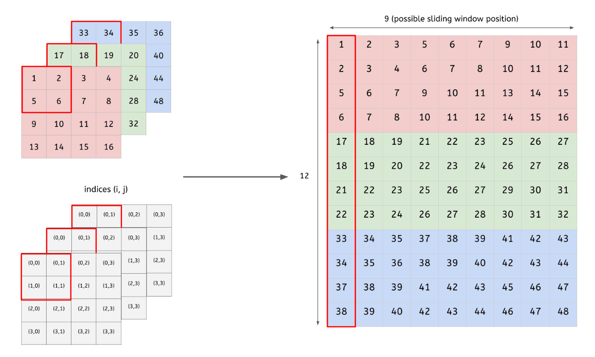
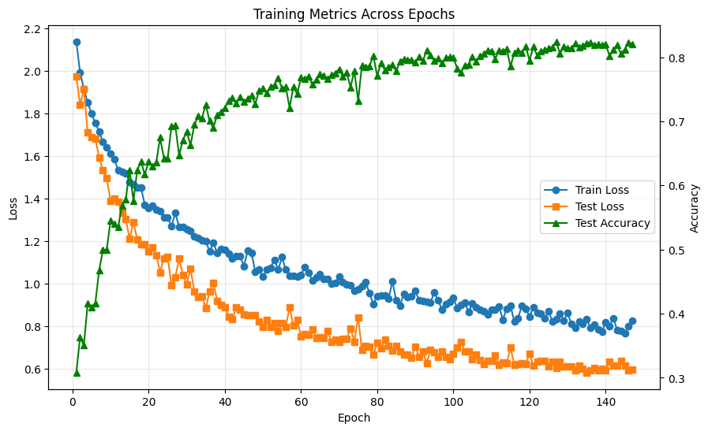
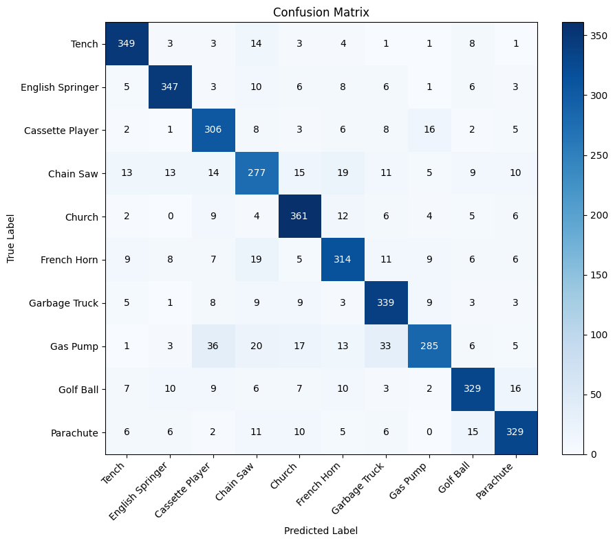
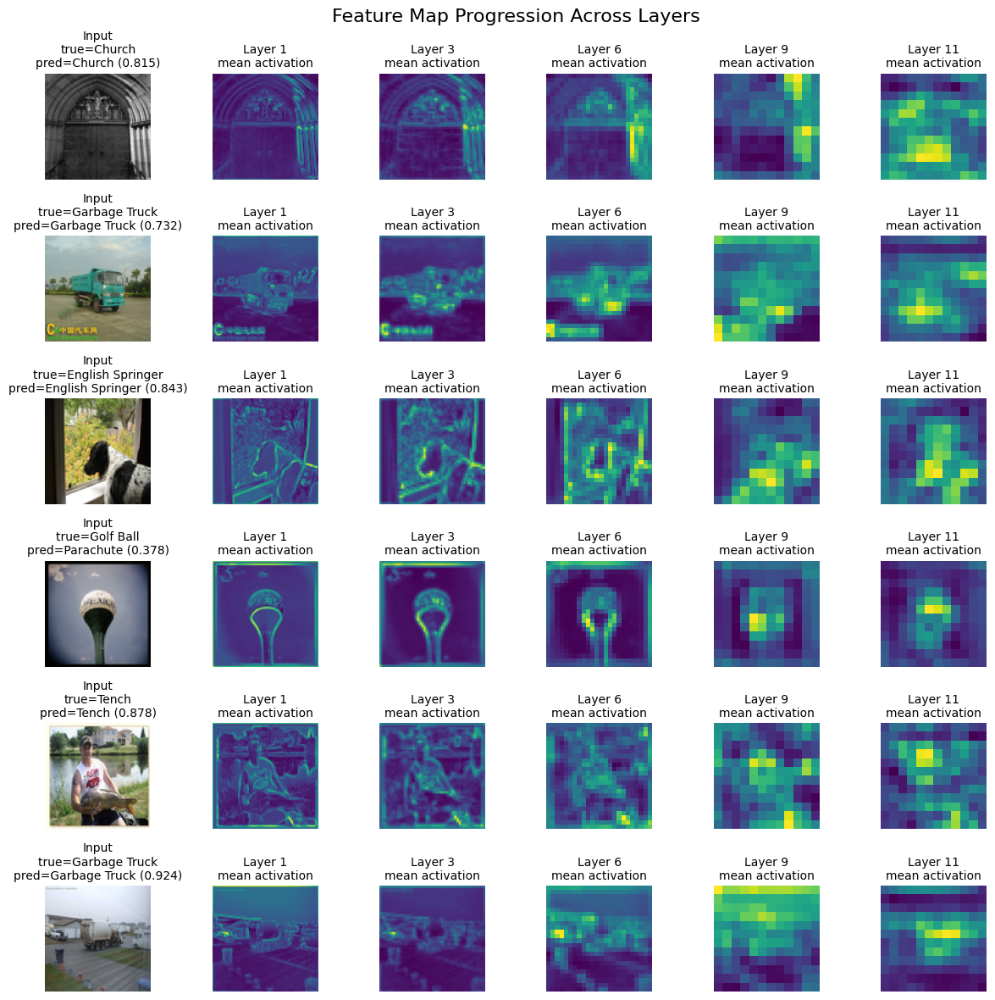

# CNN From Scratch

Implementing a convolutional neural network from scratch without deep learning frameworks, using custom layers, manual backpropagation, CuPy-based tensor operations, and a full training and evaluation workflow on a dataset with real images.

## Dataset

This project is trained and evaluated on Imagenette.

Imagenette is a smaller, easier-to-handle subset of ImageNet created by fast.ai. It contains 10 visually distinct classes sampled from the original ImageNet dataset, which makes it a good benchmark for experiments like this one: large enough to require a real CNN pipeline, but still small enough to iterate on architecture, augmentation, and optimization choices without the cost of full ImageNet training.



The 10 classes used here are:

- Tench
- English Springer
- Cassette Player
- Chain Saw
- Church
- French Horn
- Garbage Truck
- Gas Pump
- Golf Ball
- Parachute

In this repository, the dataset is loaded from the standard Imagenette train/validation folder split under `notebooks/input/imagenette2` and resized to `96x96` for training and evaluation.

## What This Project Implements

### Data Pipeline And Augmentation

- Imagenette loader with class-name mapping
- GPU-ready CuPy tensors in channel-first format
- ImageNet-style mean/std normalization
- Random crop augmentation
- Horizontal flip augmentation
- Color jitter augmentation
- CutMix augmentation with mixed labels
- Deterministic evaluation path with augmentation disabled by default



### Core CNN Components

- Custom convolution layer with vectorized `im2col` and `col2im`
- ReLU convolution block built on top of the base convolution layer
- Max pooling layer
- Global average pooling layer
- Flatten layer
- Fully connected base layer
- ReLU, sigmoid, and softmax layers
- Manual forward pass, backward pass, and parameter updates through a custom `Network` class
- He-style initialization for dense and convolutional layers
- Optional gradient clipping support inside layers
- Weight decay support during parameter updates




*Source: https://hackmd.io/@machine-learning/blog-post-cnnumpy-fast*

### Training Pipeline

- Mini-batch training loop written manually
- Categorical cross-entropy loss
- Fused softmax-cross-entropy gradient usage in the notebook training loop
- Cosine learning-rate decay across total training steps
- Early stopping based on validation accuracy
- Best-model checkpoint selection



### Evaluation And Visualization

- Final train and validation evaluation
- Confusion matrix plotting
- Per-class accuracy plotting
- Highest-confidence correct prediction gallery
- Highest-confidence incorrect prediction gallery
- Feature-map progression visualization across layers





## Key Learnings

These are the main takeaways from building and iterating on the project.

### im2col Was A Big Performance Win

Vectorized convolution with `im2col` made the model practical to train. Rewriting convolution as matrix multiplication is a major performance improvement over naive nested loops and one of the key reasons this implementation can scale beyond toy examples.

### Strong Augmentation Was Necessary

The model only started to generalize well once augmentation became both frequent and strong. Random crop, color jitter, horizontal flip, and CutMix were all important; weaker augmentation led to noticeably worse generalization.

### Architecture Matters As Much As Optimization

The final architecture worked better after reducing overly aggressive downsampling. Preserving spatial information longer and using global average pooling near the end produced a better balance between representation quality and parameter efficiency.

## Project Structure

```text
cnn-from-scratch/
├── README.md
└── notebooks/
	├── main.ipynb
	├── input/
	│   └── imagenette2/
	├── model/
	│   ├── layer.py
	│   ├── conv_layer.py
	│   ├── relu_conv_layer.py
	│   ├── max_pool_layer.py
	│   ├── global_avg_pool_layer.py
	│   ├── flatten_layer.py
	│   ├── relu_layer.py
	│   ├── sigmoid_layer.py
	│   ├── softmax_layer.py
	│   └── network.py
	└── utils/
		├── data_loader.py
		└── evaluation_helper.py
```

## Running The Project

The main workflow is notebook-driven.

### Expected Setup

- Python environment with CuPy, Pillow, and Matplotlib available
- Imagenette dataset placed under `notebooks/input/imagenette2`
- Open `notebooks/main.ipynb` and run the cells in order

**Author**: Daniel Pederzini  
**Purpose**: Deep Learning Educational Project